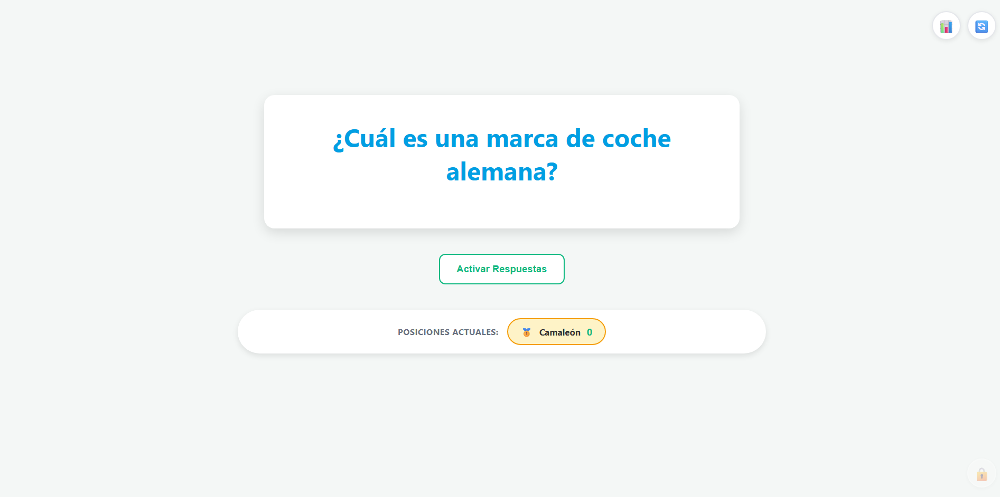
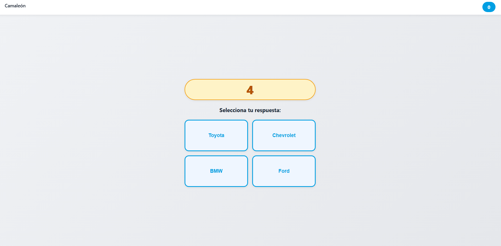

<div align="center">

# 🎮 OK TEAM Quiz

**Sistema de trivia interactivo en tiempo real para eventos presenciales.**

📌 **Proyecto desarrollado para un cliente real — Actualmente en producción**


</div>

---

## 🚀 Sobre el Proyecto

Aplicación fullstack desarrollada de forma independiente en **2 meses** para una empresa que necesitaba dinamizar sus eventos presenciales con trivias interactivas.

El sistema permite a un presentador (Host) proyectar preguntas en una pantalla grande mientras los participantes responden en tiempo real desde sus móviles. Soporta **+20 jugadores simultáneos** con sincronización instantánea.

### Capturas de Pantalla

| Vista Host (Proyector/TV) | Vista Jugador (Móvil) |
|:-------------------------:|:---------------------:|
|  |  |

| Panel de Administración | Tabla de Posiciones |
|:-----------------------:|:-------------------:|
|  |  |

---

## 💡 Desafíos Técnicos Resueltos

- **Comunicación en tiempo real:** Implementación de WebSockets con Socket.io para sincronizar estado entre Host y múltiples jugadores con latencia mínima.
- **Gestión de sesiones:** Sistema de reconexión inteligente que maneja caídas de red sin perder el estado del jugador.
- **Seguridad:** Autenticación JWT, contraseñas hasheadas con bcrypt, rate limiting (5 intentos = bloqueo 15 min), y sistema de recuperación con códigos únicos.
- **Arquitectura escalable:** Separación clara cliente-servidor en monorepo, preparado para despliegue en Railway/Render.

---

## 🛠️ Stack Tecnológico

| Backend | Frontend | Base de Datos | Tiempo Real |
|:-------:|:--------:|:-------------:|:-----------:|
| Node.js + Express | React + Vite | PostgreSQL | Socket.io |

---

## 🌐 Demo en Vivo

🔗 **[Ver aplicación](https://ok-team-quiz.onrender.com/)**

> ⚠️ **Nota:** La aplicación está alojada en el plan gratuito de Render. Si el servidor estuvo inactivo, la primera carga puede tardar entre 60-120 segundos en iniciar. Después de eso, funciona con normalidad.

---

## 📋 Tabla de Contenidos

1. [Características](#-características-principales)
2. [Instalación y Configuración](#-instalación-y-configuración-local)
3. [Despliegue](#-despliegue-producción)
4. [Estructura del Proyecto](#-estructura-del-proyecto)
5. [Manual de Uso](#-manual-de-uso-rápido)

---

## ✨ Características Principales

* **⚡ Tiempo Real:** Comunicación instantánea entre servidor y clientes usando `Socket.io` (WebSockets).
* **👥 Roles Diferenciados:**
    * **Host:** Vista diseñada para TV/Proyector. Genera código QR de acceso dinámico y muestra rankings en vivo.
    * **Jugador:** Interfaz móvil (Mobile First) optimizada para responder preguntas rápidamente. Ve la respuesta correcta en su pantalla cuando el Host la revela, y la pantalla se mantiene encendida durante la partida.
    * **Admin:** Panel protegido para gestionar la base de datos (CRUD completo de preguntas).
*  **🔐 Sistema de Seguridad Robusto:**
    * Autenticación con JWT y contraseña hasheada (bcrypt)
    * Rate limiting: más de 5 intentos de login en 15 minutos = bloqueo temporal
    * Contraseña por defecto obligatoria de cambiar al primer uso
    * Sistema de recuperación con código único (RECOV-XXXX-XXXX)
* **📊 Gestión de Jugadores:**
    * Edición manual de puntuaciones (+/- puntos)
    * Limpieza de temporada (resetear todos los jugadores)
    * Contador automático de jugadores registrados
* **🛡️ Resiliencia:** Sistema de reconexión inteligente y manejo de sesiones para evitar "jugadores fantasma" ante caídas de red.
* **📸 Multimedia:** Soporte nativo para preguntas que incluyen imágenes y videos.

---

## 🚀 Instalación y Configuración Local

### 1. Requisitos Previos
* **Node.js** (v18 o superior).
* **PostgreSQL** instalado y ejecutándose localmente.

### 2. Clonar e Instalar
El proyecto tiene dependencias tanto en la raíz (para orquestación) como en las carpetas del cliente y servidor.
```
# 1. Clonar repositorio

git clone <URL_DEL_REPO>
cd OK-TEAM-QUIZ

# 2. Instalar dependencias del Backend y generales

npm install

# 3. Instalar dependencias del Frontend

cd client
npm install
cd ..
```
### 3. Variables de Entorno

El proyecto usa dos archivos de configuración, uno para cada parte.

**Backend — `server/.env`**

Copiá `server/.env.example` como `server/.env` y completá los valores:

```env
# --- Servidor ---
PORT=3000
NODE_ENV=development

# --- Base de Datos (PostgreSQL local) ---
PGDATABASE=nombre_base_datos
PGHOST=localhost
PGUSER=postgres
PGPASSWORD=tu_password_postgres

# --- Seguridad ---
# Clave para firmar los tokens del panel de administración. Obligatoria.
# Generala con: node -e "console.log(require('crypto').randomBytes(64).toString('hex'))"
JWT_SECRET=genera_una_clave_aleatoria_de_64_bytes_aqui

# --- CORS ---
CLIENT_URL=http://localhost:5173

# --- Opcional: IP de tu PC en la red local, para probar desde el celular ---
# LOCAL_IP=192.168.1.10
```

> ⚠️ **Nota:** Ajusta los valores de base de datos según tu configuración local de PostgreSQL. En producción no se usan las variables `PG*`: la conexión se toma de `DATABASE_URL`.

**Frontend — `client/.env.local`**

Necesario para `npm run dev`: le indica al cliente dónde está el backend. Sin este archivo el socket intenta conectarse al puerto de Vite y el juego no funciona.

```env
VITE_API_URL=http://localhost:3000
VITE_SOCKET_URL=http://localhost:3000
```

Para probar desde el celular en la misma red, reemplazá `localhost` por la IP de tu PC y definí esa misma IP como `LOCAL_IP` en `server/.env`.

> 💡 **Primera vez:** Al iniciar el servidor por primera vez, se creará automáticamente la contraseña por defecto: `Admin2024!`. Deberás cambiarla al hacer tu primer login en el panel de administración.

### 4. Ejecutar en Desarrollo
Para desarrollar, necesitas dos terminales abiertas simultáneamente:

Terminal 1 (Backend), desde la raíz:
```
node server/server.js
```
Si preferís que se reinicie solo al guardar cambios, usá nodemon desde `server/`:
```
cd server
npm install
npm run dev
```

Terminal 2 (Frontend):
```
cd client
npm run dev
```

### 5. Probar desde el celular con HTTPS

Algunas funciones del navegador, como mantener la pantalla encendida (Wake Lock), solo están disponibles en páginas seguras. Por `http://` con la IP local no funcionan. Para probarlas:

```
cd client
npm run dev:https
```

Entrá desde el celular a `https://<IP-de-tu-PC>:5173/play`. La primera vez el navegador avisa que la conexión no es privada, porque el certificado es de desarrollo: aceptalo para continuar. En este modo no hace falta `client/.env.local`, y en pantalla aparece una franja con el estado del Wake Lock (solo en desarrollo). Recordá definir `LOCAL_IP` en `server/.env`.

### 6. Otros comandos útiles

| Comando | Dónde | Para qué |
|---|---|---|
| `npm test` | `server/` | Corre los tests del servidor (requiere `npm install` en `server/`) |
| `npm run lint` | `client/` | Revisa el código del frontend con ESLint |
| `npm run build` | `client/` | Genera el build de producción en `client/dist` |
| `node seed.js --confirm` | `server/` | Carga preguntas de ejemplo. **Borra todas las preguntas existentes** (no toca jugadores ni la contraseña de admin) y se niega a correr contra producción |

### 7. Tests

El servidor tiene tests de la lógica del juego, el puntaje, los jugadores, el reinicio de partida, la validación de preguntas y las contraseñas de admin. Usan [Vitest](https://vitest.dev) y no necesitan base de datos ni `.env`:

```
cd server
npm install
npm test
```

* **`npm run test:watch`** los vuelve a correr al guardar cambios.
* **`TEST_LOGS=1 npm test`** muestra los logs del servidor, útil para depurar un test que falla.
* Los tests nunca tocan la base real: simulan los modelos, y si alguno intenta una consulta de verdad falla con un mensaje que indica qué simular.

**Integración continua:** cada push y cada pull request a `master` corren en GitHub Actions los tests del servidor y el build del cliente (`.github/workflows/ci.yml`).

---

## 📦 Despliegue (Producción)

El proyecto está optimizado para desplegarse en plataformas PaaS como **Railway** o **Render**.

### Estrategia de Build
El `package.json` de la raíz orquesta el despliegue:
1.  `npm install` instala las dependencias del backend.
2.  `npm run build` instala las dependencias del frontend y compila la aplicación React en `client/dist`.
3.  `npm start` levanta el servidor Node.js, que sirve la API, los sockets y los archivos de `client/dist`.

### Pasos (Ejemplo: Railway)
1.  Conectar repositorio de GitHub a Railway.
2.  Añadir el servicio de **PostgreSQL** dentro del proyecto.
3.  Configurar las **Variables de Entorno**:
    * `PORT`: 3000 (o dejar vacío si la plataforma lo asigna automáticamente).
    * `DATABASE_URL`: (Se autoconfigura sola al añadir el plugin de Postgres).
    * `JWT_SECRET`: Generar una clave secreta fuerte. **Obligatoria.**
    * `NODE_ENV`: `production`.

### Pasos (Ejemplo: Render)
1.  Conectar repositorio de GitHub a Render.
2.  Crear un **Web Service** (no Static Site).
3.  Crear una base de datos **PostgreSQL** en Render.
4.  Configurar las **Variables de Entorno**:
    * `PORT`: (Render lo asigna automáticamente, dejar vacío)
    * `DATABASE_URL`: Copiar desde el servicio de PostgreSQL creado
    * `JWT_SECRET`: Generar una clave secreta fuerte. **Obligatoria.**
    * `NODE_ENV`: `production`
    * `VITE_API_URL` y `VITE_SOCKET_URL`: opcionales. Si se dejan vacías, el cliente usa el mismo dominio de la app, que es lo habitual.

> 💡 **CORS:** en producción se aceptan automáticamente `RENDER_EXTERNAL_URL` (Render la define sola) y `RAILWAY_STATIC_URL`. Si la app se sirve desde otro dominio, agregalo en `CLIENT_URL`.

> ⚠️ **Importante:** Render puede tardar 1-2 minutos en iniciar después de inactividad.

---

## 📂 Estructura del Proyecto
```
OK-TEAM-QUIZ/
├── client/                 # Frontend React (Vite)
│   ├── dist/               # Build de producción (generado al desplegar)
│   ├── src/
│   │   ├── pages/          # Vistas principales: Host, Admin y Landing
│   │   ├── components/
│   │   │   ├── screens/    # Pantallas del jugador (lobby, pregunta, respuesta...)
│   │   │   └── common/     # Componentes compartidos
│   │   ├── hooks/          # Conexión por socket, sesión y Wake Lock
│   │   ├── guards/         # Protección de la ruta /admin
│   │   ├── styles/         # Archivos CSS
│   │   ├── App.jsx         # Flujo del jugador
│   │   └── main.jsx        # Router
│   └── package.json
│
├── server/                 # Backend Node.js
│   ├── config/             # Base de datos, CORS y Socket.io
│   ├── controllers/        # Lógica de preguntas y jugadores
│   ├── middleware/         # Autenticación JWT
│   ├── models/             # Modelos Sequelize (Tablas)
│   ├── routes/             # Endpoints API
│   ├── sockets/            # Eventos en tiempo real del juego
│   ├── utils/              # Estado de la partida y contraseñas
│   ├── seed.js             # Preguntas de ejemplo
│   └── server.js           # Punto de entrada del servidor
│
├── package.json            # Script raíz para orquestar deploy
└── README.md               # Documentación
```

---

## 📖 Manual de Uso Rápido

1.  **Iniciar Evento (Host):**
    Abra la URL de la aplicación en la pantalla principal (TV/Proyector). El sistema detectará el dispositivo y entrará automáticamente como **HOST**.

2.  **Panel Admin:**
    Haga clic en el icono discreto de candado 🔒 (esquina inferior derecha de la vista Host) o navegue manualmente a `/admin`. 
3.  **Unirse (Jugadores):**
    Los jugadores deben escanear el código QR proyectado o entrar a la URL mostrada en sus dispositivos móviles.

4.  **Jugar:**
    El Host controla cada paso de la partida desde el proyector:
    1.  **"Iniciar Partida"** (o **"Siguiente Pregunta"**): la pregunta aparece en el proyector. Los jugadores todavía no pueden responder.
    2.  **"Activar Respuestas"**: las opciones aparecen en los celulares y arranca el temporizador.
    3.  **"Mostrar Respuesta Correcta"**: la respuesta se ve en el proyector y en los celulares.

    Si todos los jugadores responden antes de que termine el tiempo, el temporizador se detiene. El avance a la siguiente pregunta lo decide siempre el Host.

---

## 🔐 Primer Uso - Configuración Inicial

### Para el Administrador:

1.  **Primer Login:**
    * Navega a `/admin` en tu navegador
    * Usuario: (no aplica)
    * Contraseña: `Admin2024!`

2.  **Cambiar Contraseña (OBLIGATORIO):**
    * Al entrar, verás un **banner rojo** de advertencia
    * Click en "Cambiar Ahora"
    * Completa el formulario:
        - Contraseña actual: `Admin2024!`
        - Nueva contraseña: (Mínimo 8 caracteres, 1 mayúscula, 1 minúscula, 1 número)
    * Click "Guardar Nueva Contraseña"

3.  **Guardar Código de Recuperación:**
    * **MUY IMPORTANTE:** Aparecerá un modal morado con tu **código de recuperación**
    * Ejemplo: `RECOV-A3K9-PL2M`
    * **Copia o descarga este código** - lo necesitarás si olvidas tu contraseña
    * Este código se regenera cada vez que cambias la contraseña

### Si Olvidaste tu Contraseña:

1.  En la pantalla de login, click "¿Olvidaste la contraseña?"
2.  Ingresa tu **código de recuperación**
3.  Define una nueva contraseña
4.  Se generará un **nuevo código** - guárdalo de nuevo

---

## 🔧 Solución de Problemas Comunes

### "⛔ Contraseña incorrecta"
* Verifica mayúsculas/minúsculas
* Tras 5 intentos de login en 15 minutos, el acceso se bloquea temporalmente: espera y vuelve a intentar

### "⚠️ No hay preguntas cargadas"
* Debes crear al menos 1 pregunta desde `/admin` antes de iniciar

### "El video no se reproduce"
* Verifica que la URL sea de formato `/embed` (YouTube) o `/preview` (Drive)
* Algunos videos de YouTube tienen restricciones de embedding

### "Jugadores no aparecen en el host"
* Verifica que ambos estén en la misma URL (http vs https)
* Recarga la página del host

### "Socket desconectado"
* Verifica la conexión a internet
* El sistema intenta reconectarse automáticamente (hasta 5 intentos). Si no lo logra, recarga la página

### "La pantalla del celular se apaga"
* Mantener la pantalla encendida requiere HTTPS: funciona en la app publicada, no por `http://` en la red local (ver *Probar desde el celular con HTTPS*)
* En iPhone requiere iOS 16.4 o superior
* Con el **Modo Ahorro de Batería** activado, el sistema puede apagar la pantalla igual
* En iPhone, después de desbloquear el teléfono hace falta tocar la pantalla una vez para reactivarlo

---

## 📸 Gestión de Imágenes y Videos

### Subir Imágenes:

**Opción 1: Google Drive**
1.  Sube la imagen a Google Drive
2.  Click derecho → "Compartir" → "Cualquier persona con el enlace"
3.  Copia el enlace (ej: `https://drive.google.com/file/d/1A2B3C4D5E/view`)
4.  **Modifica la URL:** Cambia `/view` por `/preview`
5.  URL final: `https://drive.google.com/file/d/1A2B3C4D5E/preview`

**Opción 2: Imgur (Recomendado para imágenes)**
1.  Ve a https://imgur.com/upload
2.  Sube tu imagen (no requiere cuenta)
3.  Click derecho en la imagen → "Copiar dirección de imagen"
4.  Pega esa URL en el panel de admin

### Subir Videos:

**Opción 1: YouTube**
1.  Sube el video a YouTube (puede ser No listado)
2.  Click en "Compartir" → "Insertar"
3.  Copia SOLO la URL del atributo `src` del iframe
4.  Ejemplo: `https://www.youtube.com/embed/VIDEO_ID`

**Opción 2: Google Drive**
1.  Sube el video a Google Drive
2.  Mismo proceso que imágenes: cambiar `/view` por `/preview`

---

<div align="center">
  <sub>Desarrollado con ❤️ por Franco Reggiardo</sub>
</div>
